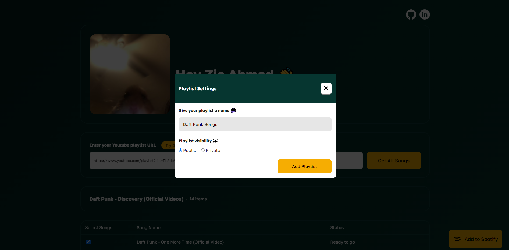

A web app to copy your songs from YouTube playlist into your Spotify account. Suppose you have a playlist with 100 songs in your youtube account. You don't want to add them manually 1 by 1, right? RIGHT!!?? 😨

That's when you can use this tool 😉

## Old Todo list, Keeping it here because someone might find it interesting

A web app that will copy your youtube songs playlist into your spotify account.

- Ask user to provide youtube playlist url.
- Fetch all songs from playlist using youtube's official api.
- Use some sort of AI's API to get official name of the each song.
- Ask AI to separate them with commas & type insert "null" for songs it could not find the name.
- Implement client side authentication of spotify. (use spotify's documentation).
- Ask user to name the playlist & hit enter to create it.
- Start the process of copying, somehow indicate the successes & failures in the UI.

#### Resources

**Spotify Authentication:** https://developer.spotify.com/documentation/general/guides/authorization/code-flow/

**Youtube API:** https://developers.google.com/youtube/v3/getting-started
